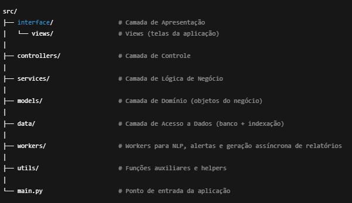

# ***Arquitetura do Projeto***

Optamos por um modelo arquitetural monolítico modular para o projeto de geração de relatórios financeiros automáticos porque ele oferece um ótimo equilíbrio entre simplicidade e escalabilidade. Essa abordagem permite que toda a aplicação seja desenvolvida e mantida dentro de um único repositório, facilitando o controle e a colaboração entre as equipes de desenvolvimento. Ao mesmo tempo, ela oferece uma estrutura modular que organiza o código de maneira eficiente, preparando o sistema para evoluir de forma organizada à medida que os requisitos se expandem.

A aplicação de padrões arquiteturais clássicos foi fundamental para garantir que cada parte do sistema tivesse uma responsabilidade clara, tornando o desenvolvimento e a manutenção mais ágeis:

* A Arquitetura em Camadas organiza o sistema de maneira que cada camada (apresentação, controle, lógica de negócio e acesso a dados) tenha um papel específico, o que facilita a manutenção e os testes sem que mudanças em uma camada impactem outras.

* Com o MVC (Model-View-Controller), conseguimos separar a lógica da interface, o que torna a aplicação mais flexível e fácil de atualizar sem quebrar as funcionalidades já existentes.

* O Repository Pattern foi implementado para garantir que o acesso a dados fosse isolado, o que torna mais simples trocar a tecnologia de banco de dados ou persistência sem afetar o resto do sistema.

* O uso do Worker Pattern, com a integração de Celery, permite que tarefas mais pesadas, como a análise de NLP e a geração de relatórios, sejam feitas de forma assíncrona, melhorando o desempenho e evitando que a aplicação trave enquanto essas tarefas são executadas.

* Finalmente, a modularização oferece uma estrutura clara, permitindo que cada parte do sistema seja desenvolvida e testada de forma independente, mas também facilita a transição para uma arquitetura distribuída ou baseada em microsserviços no futuro, caso a necessidade surja.

Essa arquitetura foi pensada para ser eficiente no curto prazo e flexível o suficiente para crescer à medida que o projeto se desenvolve, garantindo que possamos expandir e escalar conforme novas necessidades e desafios aparecerem.

## A arquitetura do projeto é organizada da seguinte forma:

* interface/: Responsável pela camada de apresentação, organiza toda a interação visual com o usuário, contendo componentes e páginas da aplicação, como layouts, inputs, filtros e dashboards interativos.

* interface/views/: Subdiretório da interface que organiza as telas principais da aplicação, como visão geral, relatórios financeiros e alertas, facilitando a separação de responsabilidades por contexto visual.

* controllers/: A camada de controle, que faz a ponte entre a interface e a lógica de negócio, orquestrando as interações entre as views e os serviços e recebendo inputs do usuário para retornar dados processados.

* services/: Contém a lógica de negócio da aplicação, incluindo regras, transformações de dados e integrações com componentes externos, como o Haystack para tarefas de sumarização de textos financeiros, geração de relatórios inteligentes e busca semântica.

* models/: Define as entidades principais do sistema (como Relatório, IndicadorFinanceiro, Tendência), padronizando os dados e facilitando a validação e o mapeamento entre as diferentes camadas.

* data/: Camada de acesso a dados, encarregada de gerenciar o armazenamento persistente, como bancos de dados e indexadores do Haystack (Elasticsearch ou FAISS), além de realizar operações de inserção, busca e atualização de dados.

* workers/: Contém os workers responsáveis por executar tarefas assíncronas, como geração de relatórios automáticos, processamento de grandes volumes de texto com Haystack e disparo de alertas com base em tendências detectadas, usando o Celery para orquestração.

* utils/: Funções auxiliares que são reutilizáveis em várias partes do projeto, como tratamento de texto, conversões de tempo e helpers para gráficos e logs, mantendo o código principal limpo e reutilizável.

* main.py: Arquivo de ponto de entrada da aplicação, que carrega as configurações e dependências, direcionando para a interface e organizando a navegação da aplicação.
